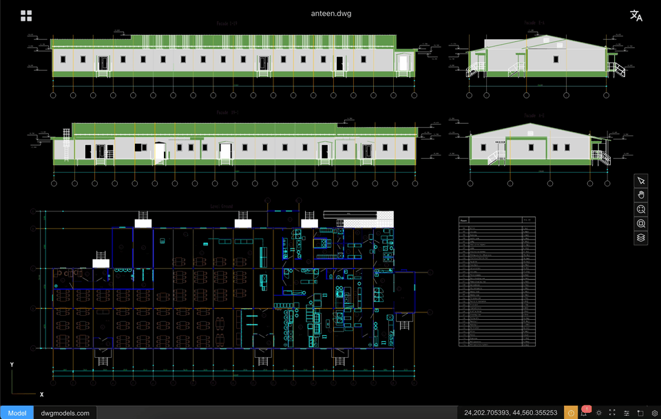

# CAD-Viewer

[简体中文](./README.zh-CN.md)

cad-viewer is `the first web-based DXF/DWG viewer and editor in the world that operates entirely in browser, without relying on any backend services`.
By performing DWG/DXF parsing, geometry processing, and rendering directly in the browser, cad-viewer enables true serverless CAD viewing and editing, ideal for cloud apps, offline usage, and privacy-sensitive workflows.

It also offers something you will rarely find in other CAD viewers—**one-click export to a single, self-contained HTML file**. The downloaded `.html` embeds the drawing snapshot and a lightweight viewer runtime, so recipients can open, pan, zoom, toggle layers, and measure distances in any modern browser with **no CAD app, no server, and no install**. Most desktop and web CAD viewers only let you view inside their own product; cad-viewer turns a live drawing into a portable, offline artifact you can email, archive, or drop on a static file host—ideal for sharing with clients, compliance archives, and air-gapped workflows. The offline viewer also uses far less memory than traditional desktop tools when opening the same drawing (see [memory comparison](#self-contained-html-memory-usage) below).

- [**🌐 Live Demo**](https://mlightcad.github.io/cad-viewer/)
- [**🌐 API Docs**](https://mlightcad.github.io/cad-viewer/docs/)
- [**🌐 Wiki**](https://github.com/mlightcad/cad-viewer/wiki)
- X (Twitter): [@mlightcad](https://x.com/mlightcad)
- YouTube: [@mlightcad](https://www.youtube.com/@mlightcad)
- Medium: [@mlightcad](https://medium.com/@mlightcad)
- Juejin(稀土掘金): [@mlightcad](https://juejin.cn/column/7501992214283501579)

### Apps Built with cad-viewer

The [Thingraph](https://cad.thingraph.site/) team builds production DWG/DXF viewers and platform integrations on top of cad-viewer, serving tens of thousands of users worldwide:

- [DWG Viewer Web App](https://cad.thingraph.site/dwg-viewer) — Browser-based DWG/DXF viewer used by engineering teams worldwide for fast, serverless drawing access. Install for your platform:
  - [Google Drive](https://workspace.google.com/marketplace/app/dwg_viewer/641533811831) — open DWG/DXF from Drive with **Open with**
  - [VS Code](https://marketplace.visualstudio.com/items?itemName=thingraph.dwg-viewer) — custom read-only editor for `.dwg` / `.dxf`
  - [Cursor](https://open-vsx.org/extension/thingraph/dwg-viewer) — same extension via Open VSX
  - [Confluence](https://marketplace.atlassian.com/apps/2890472615/dwg-viewer-for-confluence) — embed DWG/DXF previews on pages
  - [Windows Explorer](https://cad.thingraph.site/install/windows) — thumbnail and preview in File Explorer



## Features

- **High-performance** viewing of large DWG/DXF files with smooth 60+ FPS rendering
- **No backend required** - Files are parsed and processed entirely in the browser
- **Enhanced data security** - Files never leave your device, ensuring complete privacy
- **Easy integration** - No server setup or backend infrastructure needed
- Modular architecture for seamless third-party integration
- **Export to offline HTML** — Export the current drawing as one self-contained `.html` file with an embedded viewer (pan/zoom, zoom extents, layers, distance measure, EN/ZH UI). Opens offline in any browser; no cad-viewer instance or backend required.
- Offline and online editing workflows
- THREE.js 3D rendering engines with advanced optimization techniques
- Designed for extensibility and integration with platforms like CMS, Notion, and WeChat

## Getting Started

### Prerequisites

- [Node.js](https://nodejs.org/) >= 24
- [pnpm](https://pnpm.io/) >= 10

### Installation

```bash
git clone https://github.com/mlightcad/cad-viewer.git
cd cad-viewer
pnpm install
```

### Development

```bash
# Start the full-featured viewer (cad-viewer)
pnpm dev

# Or start the simple viewer
pnpm dev:simple
```

### Build

```bash
pnpm build
```

### Preview

```bash
# Preview the full-featured viewer
pnpm preview

# Preview the simple viewer
pnpm preview:simple
```

## How to Use

### Desktop Browser Operations
- **Select**: Left-click on entities
- **Zoom in/out**: Scroll mouse wheel up/down
- **Pan**: Hold middle mouse button and drag
- **Erase**: Select entities and press `Del` key

### Pad/Mobile Browser Operations
- **Select**: Tap on entities
- **Zoom**: Pinch with two fingers
- **Pan**: Single-finger drag

## Plugin System

CAD-Viewer is built around a modular **plugin system** in [`@mlightcad/cad-simple-viewer`](packages/cad-simple-viewer). Plugins implement the `AcApPlugin` interface and hook into viewer lifecycle via `onLoad` / `onUnload`—typically to register commands, add UI, or wire export/import pipelines.

Load plugins through `AcApDocManager.instance.pluginManager` (`loadPlugin`, `registerLazyPlugin`, or `plugins.fromConfig` when creating the document manager). Export-oriented plugins support **lazy loading**: register a small stub up front and download the heavy bundle only when the user runs the related command (for example `-chtml`, or when confirming export from the `chtml` dialog in `cad-viewer`).

The monorepo ships several first-party plugins. Each focuses on one concern; combine them as needed. **Installation, registration, and API details live in each package’s README**—see the links below.

### Official plugins

| Package | Role | Commands / capabilities |
|---------|------|-------------------------|
| [`@mlightcad/cad-simple-ui-plugin`](packages/cad-simple-ui-plugin) | **Toolbar & layer manager UI** for `cad-simple-viewer` (plain DOM, no Vue/React) | `layer`, default toolbar (view, measure, export, review, theme, locale) |
| [`@mlightcad/cad-agent-plugin`](packages/cad-agent-plugin) | **Natural-language CAD agent** (AI chat panel + drawing tool calls) | `agent` |
| [`@mlightcad/cad-html-plugin`](packages/cad-html-plugin) | Export drawings to **self-contained offline HTML** | `chtml` (dialog in `cad-viewer`), `-chtml` (command-line) |
| [`@mlightcad/cad-pdf-plugin`](packages/cad-pdf-plugin) | **PDF export and import** (vector pipeline) | `cpdf`, `ipdf` |
| [`@mlightcad/cad-svg-plugin`](packages/cad-svg-plugin) | **SVG export** and shared vector renderer (also used by PDF export) | `csvg` |

### `@mlightcad/cad-simple-ui-plugin` — UI chrome for the simple viewer

[`cad-simple-viewer`](packages/cad-simple-viewer) deliberately ships **no application UI**—only the canvas and CAD core. If you embed the simple viewer in your own web app and want ready-made chrome without adopting the full Vue-based [`cad-viewer`](packages/cad-viewer) shell, **`cad-simple-ui-plugin` is the intended UI layer**.

It provides:

- A **configurable toolbar** (placement on any edge, default CAD commands, nested menus, custom items)
- A **floating layer manager** (layer on/off, ACI color picker, zoom-to-layer on double-click)
- **Theme sync** with the `COLORTHEME` sysvar and `--ml-ui-*` CSS tokens on your host element
- **Locale sync** with `AcApI18n` (English / Chinese)

All widgets are framework-agnostic (plain DOM). The full Vue [`cad-viewer`](packages/cad-viewer) app has its own Element Plus UI and does not require this plugin; use `cad-simple-ui-plugin` when you build on `cad-simple-viewer` directly.

→ **Quick start, toolbar customization, and options:** [packages/cad-simple-ui-plugin/README.md](packages/cad-simple-ui-plugin/README.md)

### `@mlightcad/cad-agent-plugin` — AI drawing assistant

[`cad-agent-plugin`](packages/cad-agent-plugin) adds a **natural-language CAD agent** to `cad-simple-viewer`-based apps. Users describe what they want in plain language; the agent calls CAD tools to inspect the drawing and create or modify geometry.

It provides:

- A **lazy-loaded** `AcApPlugin` (trigger command: `agent`) so the AI bundle is not on the critical path
- A **Vue chat panel** (`AgentChatPanel`) built on the Vercel AI SDK (`Experimental_Agent` + `@ai-sdk/vue`)
- **Browser-side LLM configuration** — API keys for OpenAI, Anthropic, or OpenAI-compatible endpoints stay in the client (encrypted in `localStorage`)
- **Phase 1 CAD tools** — `get_drawing_context`; `draw_line`, `draw_circle`, `draw_arc`, `draw_rectangle`, `draw_polyline`, `draw_text`; `set_current_layer`, `create_layer`, `zoom_extents`
- **English / Chinese / Turkish / Czech** UI strings via the plugin i18n layer

The full Vue [`cad-viewer`](packages/cad-viewer) app registers the agent automatically when the package is installed (palette tab). [`cad-simple-viewer-example`](packages/cad-simple-viewer-example) wires it into a dock tab via `cad-simple-ui-plugin`. Host apps call `registerLazyAgentPlugin` and `setAgentPaletteOpener` to mount the panel where they want.

→ **Installation, registration, and tool list:** [packages/cad-agent-plugin/README.md](packages/cad-agent-plugin/README.md)

### Export plugins (HTML / PDF / SVG)

These plugins add export (and PDF import) commands to the same plugin manager. They are **lazy-loaded** so initial page weight stays small. The [`cad-simple-viewer-example`](packages/cad-simple-viewer-example) demo registers all three export plugins, `cad-simple-ui-plugin`, and `cad-agent-plugin`; the full [`cad-viewer`](packages/cad-viewer) app registers the export plugins and the agent plugin (when installed) in its bootstrap.

- **HTML** — one-file offline viewer for sharing and archiving: [packages/cad-html-plugin/README.md](packages/cad-html-plugin/README.md)  
  (Headless CLI using the same pipeline: [packages/cad-html-exporter-cli/README.md](packages/cad-html-exporter-cli/README.md))
- **PDF** — vector PDF export and PDF-to-CAD import: [packages/cad-pdf-plugin/README.md](packages/cad-pdf-plugin/README.md)
- **SVG** — vector SVG export: [packages/cad-svg-plugin/README.md](packages/cad-svg-plugin/README.md)

#### Self-contained HTML memory usage

When opening the sample drawing [`canteen.dwg`](https://cdn.jsdelivr.net/gh/mlightcad/cad-data@main/data/canteen.dwg), memory consumption is roughly:

| Viewer | Memory consumption |
|--------|-------------|
| AutoCAD 2020 | 320 MB |
| GstarCAD Viewer (浩辰看图王) | 246 MB |
| Self-contained HTML (measure mode) | 56 MB |
| Self-contained HTML (view mode) | 33 MB |

The offline HTML viewer uses about **83% less memory than AutoCAD 2020** and about **77% less than GstarCAD Viewer** in view mode, while still supporting pan/zoom, layer toggle, and distance measurement (measure mode).

## Performance

CAD-Viewer is engineered for **exceptional performance** and can handle very large DXF/DWG files while maintaining high frame rates. It employs multiple advanced rendering technologies to optimize performance:

- **Custom Shader Materials**: Uses GPU-accelerated shader materials to render complex line types and hatch fill patterns efficiently
- **Geometry Batching**: Merges points, lines, and areas with the same material to dramatically reduce draw calls
- **Instanced Rendering**: Optimizes rendering of repeated geometries through instancing techniques
- **Buffer Geometry Optimization**: Efficient memory management and geometry merging for reduced GPU overhead
- **Material Caching**: Reuses materials across similar entities to minimize state changes
- **WebGL Optimization**: Leverages modern WebGL features for hardware-accelerated rendering

These optimizations enable CAD-Viewer to smoothly render complex CAD drawings with thousands of entities while maintaining responsive user interactions.

## Known Issues

CAD-Viewer has some known limitations that users should be aware of:

- **Unsupported Entities**: 
  - **XRefs**: External references (XRefs) are not currently supported. This is mainly because file access in the browser works differently from desktop CAD applications. Support for XRefs is planned for a future release.
- **DWG File Compatibility**: 
  - Some DWG drawings may fail to open due to bugs in the underlying [LibreDWG](https://github.com/LibreDWG/libredwg) library. This is a known limitation of the current DWG parsing implementation. If you find those issues, please log one issue on [CAD-Viewer issues page](https://github.com/mlightcad/cad-viewer/issues) or [LibreDWG issues page](https://github.com/LibreDWG/libredwg/issues).
  - Drawings that contain third-party custom entities (e.g., Tianzheng drawings in the Chinese architecture and construction industry) may not display correctly unless proxy graphics are saved. When saving such drawings, ensure the system variable `PROXYGRAPHICS` is set to `1`. If proxy graphics are embedded in the file, CAD-Viewer can display them.

  Whether proxy graphics are written when saving a DWG is controlled by the system variable `PROXYGRAPHICS`:

  | Value | Meaning |
  |-------|---------|
  | 0 | Do not save proxy graphics |
  | 1 | Save proxy graphics |
- **DWG File Size Limits**:
  - Parsing DWG files with LibreDWG is memory-intensive and can easily exceed 2 GB of RAM. `libredwg-web` therefore enforces WASM heap memory limits; very large DWG files may fail to parse.
  - We offer a [**proprietary DWG parser**](./PROPRIETARY-PARSER.md) with significantly lower memory usage, support for larger files, and more accurate parsing. It integrates with the same `@mlightcad/data-model` as the open-source converters and can replace the GPL-based `libredwg-converter` stack for closed-source commercial products. See the [commercial license document](./PROPRIETARY-PARSER.md) for scope, pricing, GPL compliance, and support terms.

## Roadmap

The goal of this project is to create a full-featured **2D AutoCAD-like system in the browser** (viewer + editor), with modular architecture and framework-agnostic integration.

Legend:
- [x] Completed
- [ ] Planned
- [ ] ⏳ In progress

### Core File & Data Layer

#### File Support

* [x] DXF loading
* [x] DWG loading
* [x] Export to self-contained offline HTML (embedded viewer)
* [x] Large file streaming / incremental loading
* [ ] ⏳ File version compatibility (R12–Latest)

#### Data Model

* [x] Unified entity data model
* [x] Layer table support
* [x] Block / insert structure
* [ ] ⏳ Handle & object ID management: currently objectId is same as handle and represented as one string instead of bigint (int64).
* [ ] ⏳ XData / extension dictionary support
* [ ] Proxy entity handling

### Rendering & Performance

#### Rendering Engine

* [x] WebGL-based rendering (Three.js)
* [x] 2D-only optimized pipeline
* [x] Layer-based scene organization
* [x] Layout / paper space rendering
* [ ] Viewport entity support

#### Performance Optimization

* [x] Geometry merging & batching
* [x] Spatial indexing (basic)
* [x] Advanced spatial index (R-tree / BVH)
* [ ] Level-of-detail (LOD) rendering
* [ ] Multi-canvas / tiled rendering for very large drawings

### Viewing & Navigation

#### View Controls

* [x] Pan
* [x] Zoom (wheel / box zoom)
* [x] Fit to view / extents
* [ ] Named views
* [ ] View history (undo / redo view changes)

#### Display Controls

* [x] Layer visibility on/off
* [x] Layer freeze / lock
* [x] Lineweight display
* [ ] Linetype scaling
* [x] Background / theme switching

### Selection & Interaction

#### Selection

* [x] Single entity selection
* [x] Highlight selected entities
* [x] Window selection
* [x] Crossing selection
* [x] Selection filters (by type / layer)
* [x] Selection cycling

#### Snapping (OSNAP)

* [x] Endpoint
* [x] Midpoint
* [x] Center
* [ ] Intersection
* [ ] Perpendicular / tangent
* [x] Nearest
* [ ] Snap tracking


### Editing & Modification

#### Basic Editing

* [x] Entity editing framework
* [x] Move
* [x] Copy
* [x] Rotate
* [ ] Scale
* [x] Delete
* [x] Undo / redo

#### Geometry Editing

* [x] Grip points
* [ ] Stretch
* [ ] Trim
* [ ] Extend
* [x] Offset
* [ ] Explode
* [ ] Join / fillet / chamfer (2D)

### Drawing & Creation Tools

#### Basic Entities

* [x] Line
* [x] Polyline
* [x] Spline
* [x] Circle
* [x] Arc
* [x] Ellipse
* [x] Rectangle / polygon

#### Advanced Entities

* [x] Hatch
* [ ] Text (single-line / multi-line)
* [ ] Dimensions (linear, aligned, angular)
* [ ] Blocks creation & insertion

### Measurement

* [x] Distance
* [x] Arc length
* [x] Area
* [x] Angle
* [ ] Coordinate
* [ ] Entity statistics (length, area, count)

### Dimension

* [x] Linear dimension
* [ ] Angle dimension
* [ ] Coordinate

### Properties & UI Panels

#### Property Palette

* [x] Selected entity properties
* [ ] Layer, color, linetype editing
* [x] Live update on change

#### Panels & UI

* [x] Layer manager
* [ ] Block manager
* [x] Command history / console
* [x] Status bar (snap, ortho, grid)

#### Command System

* [x] Command registry
* [x] Command aliases
* [x] Command prompts (AutoCAD-style)

### Integration & Extensibility

#### Framework Integration

* [x] Framework-agnostic core
* [ ] React integration example
* [x] Vue integration example
* [ ] OpenLayers / Map integration
* [ ] CMS / Notion embedding

#### Plugin System

* [x] Plugin API
* [ ] Custom entity support
* [x] Custom command

### Offline & Online Editing

#### Offline Editor

* [x] Local editing in browser
* [x] Save to DXF
* [ ] Save change set / diff
* [ ] IndexedDB persistence

#### Online Editor

* [ ] Backend API design
* [ ] User authentication
* [ ] File versioning
* [ ] Multi-user access control
* [ ] Real-time collaboration (future)

### Platform Targets

* [ ] ⏳ Google Drive Integration
* [ ] WeChat Mini Program viewer
* [ ] Mobile browser support (read-only)

### Documentation & Community

* [x] Architecture documentation
* [x] API reference
* [ ] Contribution guide
* [x] Example projects
* [x] Roadmap & changelog maintenance

This roadmap is intentionally granular so contributors can clearly see **what exists**, **what is missing**, and **where help is needed**.

## Contributing

Contributions are welcome! Please open issues or pull requests for bug fixes, new features, or suggestions. For bug reports, providing a link to the problematic drawing will help in reproducing and fixing the issue.

## License

The cad-viewer monorepo is primarily [MIT](LICENSE) licensed.

DXF loading uses the built-in MIT parser in `@mlightcad/data-model`. The **default DWG loading path** in `@mlightcad/cad-simple-viewer` depends on GPL-3.0 packages (`libredwg-web` / `@mlightcad/libredwg-converter`). If you ship a closed-source product and cannot distribute GPL code to your customers, use the [**proprietary DWG parser**](./PROPRIETARY-PARSER.md) instead — it replaces that converter and lets the rest of the stack remain MIT-only.

→ **Commercial parser:** [PROPRIETARY-PARSER.md](./PROPRIETARY-PARSER.md) (scope, licensing, pricing, integration, GPL compliance, support)
