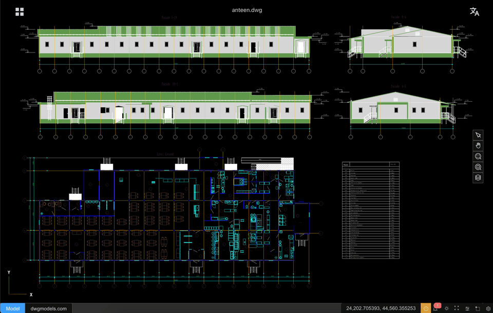

# CAD-Viewer (Português)

[English](./README.md) | [简体中文](./README.zh-CN.md) | [日本語](./README.ja.md) | [한국어](./README.ko.md) | [Español](./README.es.md) | [Português](./README.pt.md) | [Русский](./README.ru.md) | [Čeština](./README.cs.md)

O cad-viewer é `o primeiro visualizador e editor web de DXF/DWG do mundo que funciona inteiramente no navegador, sem depender de nenhum serviço de backend`.
Ao realizar a análise de DWG/DXF, o processamento geométrico e a renderização diretamente no navegador, o cad-viewer possibilita visualização e edição CAD verdadeiramente serverless, ideal para aplicativos em nuvem, uso offline e fluxos de trabalho sensíveis à privacidade.

Ele também oferece algo que você raramente encontra em outros visualizadores CAD — **exportação com um clique para um único arquivo HTML autossuficiente**. O `.html` baixado incorpora o snapshot do desenho e um runtime leve de visualização, para que os destinatários possam abrir, aplicar pan, zoom, alternar camadas e medir distâncias em qualquer navegador moderno **sem app CAD, sem servidor e sem instalação**. A maioria dos visualizadores CAD desktop e web só permite visualizar dentro do próprio produto; o cad-viewer transforma um desenho ativo em um artefato portátil e offline que você pode enviar por e-mail, arquivar ou hospedar em um servidor de arquivos estáticos — ideal para compartilhar com clientes, arquivos de conformidade e fluxos de trabalho air-gapped. O visualizador offline também usa muito menos memória do que ferramentas desktop tradicionais ao abrir o mesmo desenho (veja a [comparação de memória](#uso-de-memória-do-html-autossuficiente) abaixo).

- [**🌐 Demo ao vivo**](https://mlightcad.github.io/cad-viewer/)
- **🌐 Documentação da API**: [Read the Docs](https://cad-viewer.readthedocs.io/en/latest/) (versionada) · [GitHub Pages](https://mlightcad.github.io/cad-viewer/docs/) (latest/dev)
- [**🌐 Wiki**](https://github.com/mlightcad/cad-viewer/wiki)
- X (Twitter): [@mlightcad](https://x.com/mlightcad)
- YouTube: [@mlightcad](https://www.youtube.com/@mlightcad)
- Medium: [@mlightcad](https://medium.com/@mlightcad)
- Juejin(稀土掘金): [@mlightcad](https://juejin.cn/column/7501992214283501579)

### Aplicativos construídos com cad-viewer

A equipe [Thingraph](https://cad.thingraph.site/) constrói visualizadores DWG/DXF em produção e integrações de plataforma sobre o cad-viewer, atendendo dezenas de milhares de usuários em todo o mundo:

- [DWG Viewer Web App](https://cad.thingraph.site/dwg-viewer) — Visualizador DWG/DXF baseado em navegador usado por equipes de engenharia em todo o mundo para acesso rápido e serverless a desenhos. Instale para sua plataforma:
  - [Google Drive](https://workspace.google.com/marketplace/app/dwg_viewer/641533811831) — abra DWG/DXF do Drive com **Abrir com**
  - [VS Code](https://marketplace.visualstudio.com/items?itemName=thingraph.dwg-viewer) — editor somente leitura personalizado para `.dwg` / `.dxf`
  - [Cursor](https://open-vsx.org/extension/thingraph/dwg-viewer) — mesma extensão via Open VSX
  - [Confluence](https://marketplace.atlassian.com/apps/2890472615/dwg-viewer-for-confluence) — incorpore pré-visualizações DWG/DXF em páginas
  - [Windows Explorer](https://cad.thingraph.site/install/windows) — miniatura e pré-visualização no Explorador de Arquivos

Aplicativos e integrações da comunidade:

- [flyfish-dev/cad-viewer](https://github.com/flyfish-dev/cad-viewer) — Visualizador CAD orientado à produção para DWG, DXF, DWF, DWFx e XPS ([demo ao vivo](https://cad-viewer-iys.pages.dev))
- [Nextcloud CAD Viewer](https://github.com/ashcoft/nextcloud-cad-viewer) — App nativo do Nextcloud para visualizar DWG/DXF no navegador ([App Store](https://apps.nextcloud.com/apps/cad_viewer))

Pacotes desktop Linux da comunidade:

- [CAD Viewer AppImage](https://github.com/pass-wind/cad-viewer-appimage) — AppImage baseado em Electron para Linux (~114 MB), testado no Fedora
- [cad-viewer (AUR)](https://aur.archlinux.org/packages/cad-viewer) — Pacote fonte Arch Linux usando Electron do sistema (~5,4 MB)
- [cad-viewer-bin (AUR)](https://aur.archlinux.org/packages/cad-viewer-bin) — Pacote binário Arch Linux com fontes/templates incluídos para abertura totalmente offline de desenhos



## Recursos

- Visualização **de alto desempenho** de arquivos DWG/DXF grandes com renderização suave a 60+ FPS
- **Sem backend necessário** — Os arquivos são analisados e processados inteiramente no navegador
- **Segurança de dados aprimorada** — Os arquivos nunca saem do seu dispositivo, garantindo privacidade total
- **Integração fácil** — Sem configuração de servidor ou infraestrutura de backend
- Arquitetura modular para integração fluida com terceiros
- **Exportação para HTML offline** — Exporte o desenho atual como um único arquivo `.html` autossuficiente com visualizador incorporado (pan/zoom, zoom extents, camadas, medição de distância, UI EN/ZH). Abre offline em qualquer navegador; não requer instância do cad-viewer ou backend.
- Fluxos de trabalho de edição offline e online
- Motores de renderização 3D THREE.js com técnicas avançadas de otimização
- Projetado para extensibilidade e integração com plataformas como CMS, Notion e WeChat

## Primeiros passos

### Pré-requisitos

- [Node.js](https://nodejs.org/) >= 24
- [pnpm](https://pnpm.io/) >= 10

### Instalação

```bash
git clone https://github.com/mlightcad/cad-viewer.git
cd cad-viewer
pnpm install
```

### Desenvolvimento

```bash
# Iniciar o visualizador completo (cad-viewer)
pnpm dev

# Ou iniciar o visualizador simples
pnpm dev:simple
```

### Build

```bash
pnpm build
```

### Pré-visualização

```bash
# Pré-visualizar o visualizador completo
pnpm preview

# Pré-visualizar o visualizador simples
pnpm preview:simple
```

## Como usar

### Operações no navegador desktop
- **Selecionar**: Clique com o botão esquerdo nas entidades
- **Ampliar/reduzir zoom**: Role a roda do mouse para cima/baixo
- **Pan**: Segure o botão do meio do mouse e arraste
- **Apagar**: Selecione entidades e pressione a tecla `Del`

### Operações no navegador tablet/mobile
- **Selecionar**: Toque nas entidades
- **Zoom**: Pinça com dois dedos
- **Pan**: Arraste com um dedo

## Sistema de plugins

O CAD-Viewer é construído em torno de um **sistema de plugins** modular em [`@mlightcad/cad-simple-viewer`](packages/cad-simple-viewer). Os plugins implementam a interface `AcApPlugin` e se conectam ao ciclo de vida do visualizador via `onLoad` / `onUnload` — normalmente para registrar comandos, adicionar UI ou conectar pipelines de exportação/importação.

Carregue plugins por meio de `AcApDocManager.instance.pluginManager` (`loadPlugin`, `registerLazyPlugin` ou `plugins.fromConfig` ao criar o gerenciador de documentos). Plugins orientados à exportação suportam **lazy loading**: registre um stub pequeno antecipadamente e baixe o bundle pesado somente quando o usuário executar o comando relacionado (por exemplo `-chtml`, ou ao confirmar a exportação na caixa de diálogo `chtml` no `cad-viewer`).

O monorepo inclui vários plugins oficiais. Cada um foca em uma preocupação; combine-os conforme necessário. **Instalação, registro e detalhes da API estão no README de cada pacote** — veja os links abaixo.

### Plugins oficiais

| Pacote | Função | Comandos / capacidades |
|--------|--------|------------------------|
| [`@mlightcad/cad-simple-ui-plugin`](packages/cad-simple-ui-plugin) | **UI de barra de ferramentas e gerenciador de camadas** para `cad-simple-viewer` (DOM puro, sem Vue/React) | `layer`, barra de ferramentas padrão (view, measure, export, review, theme, locale) |
| [`@mlightcad/cad-agent-plugin`](packages/cad-agent-plugin) | **Agente CAD em linguagem natural** (painel de chat com IA + chamadas de ferramentas de desenho) | `agent` |
| [`@mlightcad/cad-html-plugin`](packages/cad-html-plugin) | Exportar desenhos para **HTML offline autossuficiente** | `chtml` (diálogo no `cad-viewer`), `-chtml` (linha de comando) |
| [`@mlightcad/cad-pdf-plugin`](packages/cad-pdf-plugin) | **Exportação e importação de PDF** (pipeline vetorial) | `cpdf`, `ipdf` |
| [`@mlightcad/cad-svg-plugin`](packages/cad-svg-plugin) | **Exportação SVG** e renderizador vetorial compartilhado (também usado pela exportação PDF) | `csvg` |

### `@mlightcad/cad-simple-ui-plugin` — UI chrome para o visualizador simples

O [`cad-simple-viewer`](packages/cad-simple-viewer) deliberadamente **não inclui UI de aplicativo** — apenas o canvas e o núcleo CAD. Se você incorporar o visualizador simples em seu próprio app web e quiser chrome pronto sem adotar o shell completo baseado em Vue do [`cad-viewer`](packages/cad-viewer), **`cad-simple-ui-plugin` é a camada de UI indicada**.

Ele fornece:

- Uma **barra de ferramentas configurável** (posicionamento em qualquer borda, comandos CAD padrão, menus aninhados, itens personalizados)
- Um **gerenciador de camadas flutuante** (camada ligada/desligada, seletor de cor ACI, zoom para camada com duplo clique)
- **Sincronização de tema** com a sysvar `COLORTHEME` e tokens CSS `--ml-ui-*` no seu elemento host
- **Sincronização de locale** com `AcApI18n` (inglês / chinês)

Todos os widgets são agnósticos a framework (DOM puro). O app completo Vue [`cad-viewer`](packages/cad-viewer) tem sua própria UI Element Plus e não requer este plugin; use `cad-simple-ui-plugin` quando construir diretamente sobre `cad-simple-viewer`.

→ **Início rápido, personalização da barra de ferramentas e opções:** [packages/cad-simple-ui-plugin/README.md](packages/cad-simple-ui-plugin/README.md)

### `@mlightcad/cad-agent-plugin` — Assistente de desenho com IA

O [`cad-agent-plugin`](packages/cad-agent-plugin) adiciona um **agente CAD em linguagem natural** a apps baseados em `cad-simple-viewer`. Os usuários descrevem o que querem em linguagem simples; o agente chama ferramentas CAD para inspecionar o desenho e criar ou modificar geometria.

Ele fornece:

- Um `AcApPlugin` **lazy-loaded** (comando de acionamento: `agent`) para que o bundle de IA não esteja no caminho crítico
- Um **painel de chat Vue** (`AgentChatPanel`) construído sobre o Vercel AI SDK (`Experimental_Agent` + `@ai-sdk/vue`)
- **Configuração de LLM no navegador** — chaves de API para OpenAI, Anthropic ou endpoints compatíveis com OpenAI permanecem no cliente (criptografadas em `localStorage`)
- **Ferramentas CAD Fase 1** — `get_drawing_context`; `draw_line`, `draw_circle`, `draw_arc`, `draw_rectangle`, `draw_polyline`, `draw_text`; `set_current_layer`, `create_layer`, `zoom_extents`
- Strings de UI em **inglês / chinês / turco / tcheco** via a camada i18n do plugin

O app completo Vue [`cad-viewer`](packages/cad-viewer) registra o agente automaticamente quando o pacote está instalado (aba da paleta). O [`cad-simple-viewer-example`](packages/cad-simple-viewer-example) o conecta em uma aba dock via `cad-simple-ui-plugin`. Apps host chamam `registerLazyAgentPlugin` e `setAgentPaletteOpener` para montar o painel onde desejarem.

→ **Instalação, registro e lista de ferramentas:** [packages/cad-agent-plugin/README.md](packages/cad-agent-plugin/README.md)

### Plugins de exportação (HTML / PDF / SVG)

Esses plugins adicionam comandos de exportação (e importação PDF) ao mesmo gerenciador de plugins. São **lazy-loaded** para que o peso inicial da página permaneça pequeno. A demo [`cad-simple-viewer-example`](packages/cad-simple-viewer-example) registra os três plugins de exportação, `cad-simple-ui-plugin` e `cad-agent-plugin`; o app completo [`cad-viewer`](packages/cad-viewer) registra os plugins de exportação e o plugin do agente (quando instalado) em seu bootstrap.

- **HTML** — visualizador offline de arquivo único para compartilhamento e arquivamento: [packages/cad-html-plugin/README.md](packages/cad-html-plugin/README.md)  
  (CLI headless usando o mesmo pipeline: [packages/cad-html-exporter-cli/README.md](packages/cad-html-exporter-cli/README.md))
- **PDF** — exportação vetorial de PDF e importação PDF-para-CAD: [packages/cad-pdf-plugin/README.md](packages/cad-pdf-plugin/README.md)
- **SVG** — exportação vetorial SVG: [packages/cad-svg-plugin/README.md](packages/cad-svg-plugin/README.md)

#### Uso de memória do HTML autossuficiente

Ao abrir o desenho de exemplo [`canteen.dwg`](https://cdn.jsdelivr.net/gh/mlightcad/cad-data@main/data/canteen.dwg), o consumo de memória é aproximadamente:

| Visualizador | Consumo de memória |
|--------------|-------------------|
| AutoCAD 2020 | 320 MB |
| GstarCAD Viewer (浩辰看图王) | 246 MB |
| HTML autossuficiente (modo de medição) | 56 MB |
| HTML autossuficiente (modo de visualização) | 33 MB |

O visualizador HTML offline usa cerca de **83% menos memória que o AutoCAD 2020** e cerca de **77% menos que o GstarCAD Viewer** no modo de visualização, ainda suportando pan/zoom, alternância de camadas e medição de distância (modo de medição).

## Desempenho

O CAD-Viewer foi projetado para **desempenho excepcional** e pode lidar com arquivos DXF/DWG muito grandes mantendo altas taxas de quadros. Ele emprega múltiplas tecnologias avançadas de renderização para otimizar o desempenho:

- **Materiais Shader personalizados**: Usa materiais shader acelerados por GPU para renderizar tipos de linha complexos e padrões de preenchimento hatch com eficiência
- **Agrupamento de geometria**: Mescla pontos, linhas e áreas com o mesmo material para reduzir drasticamente draw calls
- **Renderização instanciada**: Otimiza a renderização de geometrias repetidas por meio de técnicas de instancing
- **Otimização de Buffer Geometry**: Gerenciamento eficiente de memória e mesclagem de geometria para reduzir overhead de GPU
- **Cache de materiais**: Reutiliza materiais entre entidades similares para minimizar mudanças de estado
- **Otimização WebGL**: Aproveita recursos modernos de WebGL para renderização acelerada por hardware

Essas otimizações permitem que o CAD-Viewer renderize suavemente desenhos CAD complexos com milhares de entidades mantendo interações responsivas do usuário.

## Problemas conhecidos

O caminho DWG open-source padrão é baseado em [LibreDWG](https://github.com/LibreDWG/libredwg). Funciona bem para muitos desenhos, mas sua cobertura de entidades ainda é limitada, o bundle WASM é muito maior, a inicialização é mais lenta, o uso de memória é alto e arquivos DWG muito grandes podem encontrar erros de falta de memória. Também introduz considerações de licenciamento GPL para produtos comerciais closed-source.

Se você precisa de melhor compatibilidade, menor uso de memória, suporte a arquivos grandes ou uma história de licenciamento comercial mais limpa, veja nosso [**parser DWG proprietário**](./PROPRIETARY-PARSER.md).

| Item | Parser baseado em LibreDWG | Parser DWG proprietário |
|------|----------------------------|-------------------------|
| Entidades suportadas | Cobertura limitada | Cobertura mais ampla |
| Tamanho do bundle | ~13 MB | ~437 KB |
| Velocidade de carregamento | Inicialização mais lenta | Inicialização muito mais rápida |
| Uso de memória | Maior | Menor |
| Arquivos DWG grandes | Pode causar OOM em arquivos grandes | Sem esse problema |
| Licença | Risco de propagação GPL | Sem problema de propagação GPL |

## Roadmap

O objetivo deste projeto é criar um **sistema 2D semelhante ao AutoCAD no navegador** (visualizador + editor), com arquitetura modular e integração agnóstica a framework.

Legenda:
- [x] Concluído
- [ ] Planejado
- [ ] ⏳ Em andamento

### Camada central de arquivos e dados

#### Suporte a arquivos

* [x] Carregamento DXF
* [x] Carregamento DWG
* [x] Exportação para HTML offline autossuficiente (visualizador incorporado)
* [x] Streaming de arquivos grandes / carregamento incremental
* [ ] ⏳ Compatibilidade de versão de arquivo (R12–Latest)

#### Modelo de dados

* [x] Modelo de dados unificado de entidades
* [x] Suporte a tabela de camadas
* [x] Estrutura de bloco / insert
* [ ] ⏳ Gerenciamento de handle e object ID: atualmente objectId é igual ao handle e representado como uma string em vez de bigint (int64).
* [ ] ⏳ Suporte a XData / dicionário de extensão
* [ ] Tratamento de entidades proxy

### Renderização e desempenho

#### Motor de renderização

* [x] Renderização baseada em WebGL (Three.js)
* [x] Pipeline otimizado apenas 2D
* [x] Organização de cena baseada em camadas
* [x] Renderização de layout / paper space
* [ ] Suporte a entidade viewport

#### Otimização de desempenho

* [x] Mesclagem e agrupamento de geometria
* [x] Indexação espacial (básica)
* [x] Índice espacial avançado (R-tree / BVH)
* [ ] Renderização level-of-detail (LOD)
* [ ] Multi-canvas / renderização em tiles para desenhos muito grandes

### Visualização e navegação

#### Controles de visualização

* [x] Pan
* [x] Zoom (roda / box zoom)
* [x] Ajustar à visualização / extents
* [ ] Visualizações nomeadas
* [ ] Histórico de visualização (desfazer / refazer mudanças de visualização)

#### Controles de exibição

* [x] Visibilidade de camada ligada/desligada
* [x] Congelar / bloquear camada
* [x] Exibição de espessura de linha
* [ ] Escala de tipo de linha
* [x] Alternância de fundo / tema

### Seleção e interação

#### Seleção

* [x] Seleção de entidade única
* [x] Destacar entidades selecionadas
* [x] Seleção por janela
* [x] Seleção por cruzamento
* [x] Filtros de seleção (por tipo / camada)
* [x] Ciclo de seleção

#### Snap (OSNAP)

* [x] Endpoint
* [x] Midpoint
* [x] Center
* [ ] Intersection
* [ ] Perpendicular / tangent
* [x] Nearest
* [ ] Snap tracking


### Edição e modificação

#### Edição básica

* [x] Framework de edição de entidades
* [x] Move
* [x] Copy
* [x] Rotate
* [ ] Scale
* [x] Delete
* [x] Undo / redo

#### Edição geométrica

* [x] Grip points
* [ ] Stretch
* [ ] Trim
* [ ] Extend
* [x] Offset
* [ ] Explode
* [ ] Join / fillet / chamfer (2D)

### Ferramentas de desenho e criação

#### Entidades básicas

* [x] Line
* [x] Polyline
* [x] Spline
* [x] Circle
* [x] Arc
* [x] Ellipse
* [x] Rectangle / polygon

#### Entidades avançadas

* [x] Hatch
* [ ] Text (single-line / multi-line)
* [ ] Dimensions (linear, aligned, angular)
* [ ] Blocks creation & insertion

### Medição

* [x] Distance
* [x] Arc length
* [x] Area
* [x] Angle
* [ ] Coordinate
* [ ] Entity statistics (length, area, count)

### Cota

* [x] Linear dimension
* [ ] Angle dimension
* [ ] Coordinate

### Propriedades e painéis de UI

#### Paleta de propriedades

* [x] Propriedades da entidade selecionada
* [ ] Edição de camada, cor, tipo de linha
* [x] Atualização ao vivo na mudança

#### Painéis e UI

* [x] Gerenciador de camadas
* [ ] Gerenciador de blocos
* [x] Histórico de comandos / console
* [x] Barra de status (snap, ortho, grid)

#### Sistema de comandos

* [x] Registro de comandos
* [x] Aliases de comandos
* [x] Prompts de comando (estilo AutoCAD)

### Integração e extensibilidade

#### Integração com frameworks

* [x] Núcleo agnóstico a framework
* [ ] Exemplo de integração React
* [x] Exemplo de integração Vue
* [ ] Integração OpenLayers / Map
* [ ] Incorporação CMS / Notion

#### Sistema de plugins

* [x] API de plugins
* [ ] Suporte a entidades personalizadas
* [x] Comando personalizado

### Edição offline e online

#### Editor offline

* [x] Edição local no navegador
* [x] Salvar em DXF
* [ ] Salvar change set / diff
* [ ] Persistência IndexedDB

#### Editor online

* [ ] Design de API de backend
* [ ] Autenticação de usuário
* [ ] Versionamento de arquivos
* [ ] Controle de acesso multiusuário
* [ ] Colaboração em tempo real (futuro)

### Plataformas-alvo

* [ ] ⏳ Integração com Google Drive
* [ ] Visualizador WeChat Mini Program
* [ ] Suporte a navegador mobile (somente leitura)

### Documentação e comunidade

* [x] Documentação de arquitetura
* [x] Referência de API
* [ ] Guia de contribuição
* [x] Projetos de exemplo
* [x] Manutenção de roadmap e changelog

Este roadmap é intencionalmente granular para que os colaboradores possam ver claramente **o que existe**, **o que falta** e **onde a ajuda é necessária**.

## Contribuindo

Contribuições são bem-vindas! Abra issues ou pull requests para correções de bugs, novos recursos ou sugestões. Para relatórios de bug, fornecer um link para o desenho problemático ajudará a reproduzir e corrigir o problema.

## Licença

O monorepo cad-viewer é licenciado principalmente sob [MIT](LICENSE).

O carregamento DXF usa o parser MIT integrado em `@mlightcad/data-model`. O **caminho padrão de carregamento DWG** em `@mlightcad/cad-simple-viewer` depende de pacotes GPL-3.0 (`libredwg-web` / `@mlightcad/libredwg-converter`). Se você distribui um produto closed-source e não pode distribuir código GPL aos seus clientes, use o [**parser DWG proprietário**](./PROPRIETARY-PARSER.md) — ele substitui esse conversor e permite que o restante da stack permaneça apenas MIT.

→ **Parser comercial:** [PROPRIETARY-PARSER.md](./PROPRIETARY-PARSER.md) (escopo, licenciamento, preços, integração, conformidade GPL, suporte)
