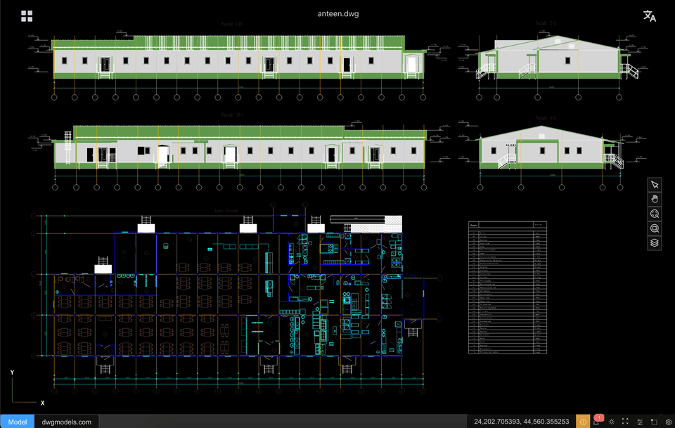

# CAD-Viewer（中文）

[English](./README.md)

CAD-Viewer 是`全球首个完全运行在浏览器端、无需依赖任何后端服务的 Web 版 DXF/DWG 查看与编辑器`。
通过在浏览器中直接完成 DWG/DXF 解析、几何处理和渲染，CAD-Viewer 实现了真正的无服务器（serverless）CAD 查看与编辑，非常适合云应用、离线使用以及对隐私敏感的工作场景。

- [**🌐 在线演示**](https://mlightcad.github.io/cad-viewer/)
- [**🌐 API 文档**](https://mlightcad.github.io/cad-viewer/docs/)
- [**🌐 项目 Wiki**](https://github.com/mlightcad/cad-viewer/wiki)
- X (Twitter): [@mlightcad](https://x.com/mlightcad)
- YouTube: [@mlightcad](https://www.youtube.com/@mlightcad)
- Medium: [@mlightcad](https://medium.com/@mlightcad)
- 稀土掘金: [@mlightcad](https://juejin.cn/column/7501992214283501579)

## 功能特性

- **高性能**：大体量 DWG/DXF 文件也能以流畅的 60+ FPS 渲染
- **无需后端**：文件在浏览器本地解析与处理
- **数据更安全**：文件不离开本地设备，保护隐私
- **易于集成**：无需服务器或后端基础设施
- 模块化架构，便于第三方系统集成
- 支持离线与在线编辑流程
- 基于 THREE.js 的 3D 渲染引擎，包含多项性能优化
- 面向可扩展与二次开发，适配 CMS、Notion、微信等平台

## 使用说明

### 桌面浏览器操作
- **选择**：鼠标左键单击实体
- **缩放**：滚动鼠标滚轮上/下
- **平移**：按住鼠标中键拖拽
- **删除**：选中实体后按 `Del` 键

### 平板/手机浏览器操作
- **选择**：轻触实体
- **缩放**：双指捏合放大/缩小
- **平移**：双指拖动移动视图

## 性能优化

CAD-Viewer 针对复杂图纸渲染进行了多项优化，可在保持高帧率的同时处理大规模 DXF/DWG 文件：

- **自定义着色器材质**：在 GPU 侧高效绘制复杂线型与剖面填充
- **几何体合批**：对相同材质的点/线/面进行合并，显著减少 draw call
- **实例化渲染**：针对重复几何体进行实例化优化
- **缓冲几何优化**：高效的内存管理与几何合并，降低 GPU 开销
- **材质缓存**：复用相似实体的材质以减少状态切换
- **WebGL 优化**：充分利用现代 WebGL 的硬件加速能力

这些优化使得 CAD-Viewer 能够在渲染大量复杂实体的同时保持交互顺畅。

## 已知问题

- **不支持的实体**：
  - **表格（仅 DWG）**：当前使用的 [LibreDWG](https://github.com/LibreDWG/libredwg) 库尚不支持 DWG 表格实体；若表格由线段/多段线构成，则可正常显示。
  - **外部参照（XRef）**：暂不支持显示。
- **DWG 兼容性**：
  - 部分 DWG 图纸可能因 [LibreDWG](https://github.com/LibreDWG/libredwg) 的问题无法打开。若遇到此类问题，欢迎在 [CAD-Viewer 问题页](https://github.com/mlightcad/cad-viewer/issues) 或 [LibreDWG 问题页](https://github.com/LibreDWG/libredwg/issues) 反馈。
  - 国内建筑行业大量使用`天正软件`来创建 CAD 图纸，但天正中的许多图元属于其自定义对象，且未提供公开的 API 用于解析其内部数据。因此，在使用 CAD-Viewer 打开此类图纸之前，需要先通过天正软件将图纸转换为 T3 格式。完成转换后，即可使用 CAD-Viewer 正常打开和查看图纸内容。

上述限制将会在后续版本中逐步改进。

## 路线图（Roadmap）

本项目的目标是打造一个**运行在浏览器中的、功能完整的二维 AutoCAD 系统**（查看器 + 编辑器），具备模块化架构，并且可与各类前端框架无关地进行集成。

图例说明：

-   [x] 已完成
-   [ ] 计划中
-   [ ] ⏳ 进行中

### 核心文件与数据层

#### 文件支持

-   [x] DXF 加载
-   [x] DWG 加载
-   [x] 大文件流式加载 / 增量加载
-   [ ] ⏳ 文件版本兼容（R12–最新版本）

#### 数据模型

-   [x] 统一的实体数据模型
-   [x] 图层表支持
-   [x] 块（Block）/ 插入（Insert）结构
-   [ ] ⏳ Handle 与对象 ID 管理：当前 objectId 与 handle 相同，并且以字符串表示，而不是 bigint（int64）
-   [ ] XData / 扩展字典支持
-   [ ] 代理实体（Proxy Entity）处理

### 渲染与性能

#### 渲染引擎

-   [x] 基于 WebGL 的渲染（Three.js）
-   [x] 仅针对 2D 的优化渲染管线
-   [x] 基于图层的场景组织
-   [ ] 布局（Layout）/ 图纸空间（Paper Space）渲染
-   [ ] 视口（Viewport）实体支持

#### 性能优化

-   [x] 几何体合并与批处理
-   [x] 空间索引（基础）
-   [x] 高级空间索引（R-tree / BVH）
-   [ ] 细节层次（LOD）渲染
-   [ ] 超大图纸的多画布 / 分块渲染

### 查看与导航

#### 视图控制

-   [x] 平移（Pan）
-   [x] 缩放（滚轮 / 框选缩放）
-   [x] 适配视图 / 显示范围
-   [ ] 命名视图
-   [ ] 视图历史（撤销 / 重做视图变更）

#### 显示控制

-   [x] 图层显示 / 隐藏
-   [ ] 图层冻结 / 锁定
-   [ ] 线宽显示
-   [ ] 线型比例
-   [ ] ⏳ 背景 / 主题切换

### 选择与交互

#### 选择

-   [x] 单个实体选择
-   [x] 选中实体高亮
-   [ ] 窗口选择（Window Selection）
-   [ ] 交叉选择（Crossing Selection）
-   [ ] 选择过滤（按类型 / 图层）
-   [ ] 循环选择（Selection Cycling）

#### 捕捉（OSNAP）

-   [ ] ⏳ 端点（Endpoint）：当前尚未支持 INSERT 实体
-   [x] 中点（Midpoint）
-   [ ] 圆心（Center）
-   [ ] 交点（Intersection）
-   [ ] 垂足 / 切点（Perpendicular / Tangent）
-   [ ] ⏳ 最近点（Nearest）
-   [ ] 捕捉追踪（Snap Tracking）

### 编辑与修改

#### 基础编辑

-   [x] 实体编辑框架
-   [ ] 移动（Move）
-   [ ] 复制（Copy）
-   [ ] 旋转（Rotate）
-   [ ] 缩放（Scale）
-   [x] 删除（Delete）
-   [ ] 撤销 / 重做（Undo / Redo）

#### 几何编辑

-   [ ] 夹点（Grip Points）
-   [ ] 拉伸（Stretch）
-   [ ] 修剪（Trim）
-   [ ] 延伸（Extend）
-   [ ] 偏移（Offset）
-   [ ] 分解（Explode）
-   [ ] 连接 / 圆角 / 倒角（2D）

### 绘制与创建工具

#### 基础实体

-   [x] 直线（Line）
-   [ ] 多段线（Polyline）
-   [x] 圆（Circle）
-   [ ] 圆弧（Arc）
-   [ ] 椭圆（Ellipse）
-   [ ] 矩形 / 多边形（Rectangle / Polygon）

#### 高级实体

-   [ ] 填充（Hatch）
-   [ ] 文本（单行 / 多行）
-   [ ] 标注（线性、对齐、角度）
-   [ ] 块创建与插入

### 测量与标注

-   [ ] ⏳ 距离测量与标注
-   [ ] 面积测量与标注
-   [ ] 角度测量与标注
-   [ ] 坐标读取
-   [ ] 实体统计（长度、面积、数量）

### 属性与 UI 面板

#### 属性面板（Property Palette）

-   [x] 选中实体属性
-   [ ] 图层、颜色、线型编辑
-   [x] 属性修改实时更新

#### 面板与界面

-   [x] 图层管理器
-   [ ] 块管理器
-   [x] 命令历史 / 控制台
-   [ ] ⏳ 状态栏（捕捉、正交、网格）

#### 命令系统

-   [x] 命令注册机制
-   [ ] 命令别名
-   [ ] 键盘驱动工作流
-   [x] 命令提示（AutoCAD 风格）

### 集成与可扩展性

#### 框架集成

-   [x] 与前端框架无关的核心设计
-   [ ] React 集成示例
-   [ ] Vue 集成示例
-   [ ] OpenLayers / 地图集成
-   [ ] CMS / Notion 嵌入

#### 插件系统

-   [ ] 插件 API
-   [ ] 自定义实体支持
-   [ ] 自定义命令注入

### 离线与在线编辑

#### 离线编辑器

-   [ ] 浏览器本地编辑
-   [ ] 保存为 DXF
-   [ ] 保存变更集 / 差异（diff）
-   [ ] IndexedDB 持久化

#### 在线编辑器

-   [ ] 后端 API 设计
-   [ ] 用户认证
-   [ ] 文件版本管理
-   [ ] 多用户访问控制
-   [ ] 实时协作（未来）

### 平台目标

-   [ ] ⏳ Google Drive 集成
-   [ ] 微信小程序查看器
-   [ ] 移动端浏览器支持（只读）

### 文档与社区

-   [x] 架构文档
-   [x] API 参考文档
-   [ ] 贡献指南
-   [x] 示例项目
-   [x] 路线图与变更日志维护

该路线图刻意拆分得较为细致，以便贡献者能够清楚地了解 **已有功能**、**缺失功能** 以及 **最需要帮助的方向**。

## 参与贡献（Contributing）

欢迎各种形式的贡献！你可以通过提交 issue 或 pull request 来修复 bug、添加新功能或提出建议。  
在提交 bug 报告时，如果能提供有问题的图纸链接，将有助于问题的复现与修复。

## 许可证

[MIT](LICENSE)

